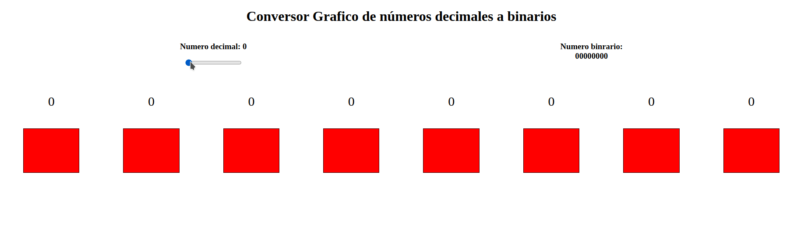

# Conversor-Gráfico-Decimal-Binario  V 1.0.0
---
Conversor gráfico de números decimales a binarios.

Solo se simulan 8 bits por lo que solo son representados números entre 0 y 255.

<ul>
<li>Un rectángulo verde simula un bit prendido.</li>

<li>Un rectángulo rojo simula un bit apagado.</li>
</ul>

## Preview
---

